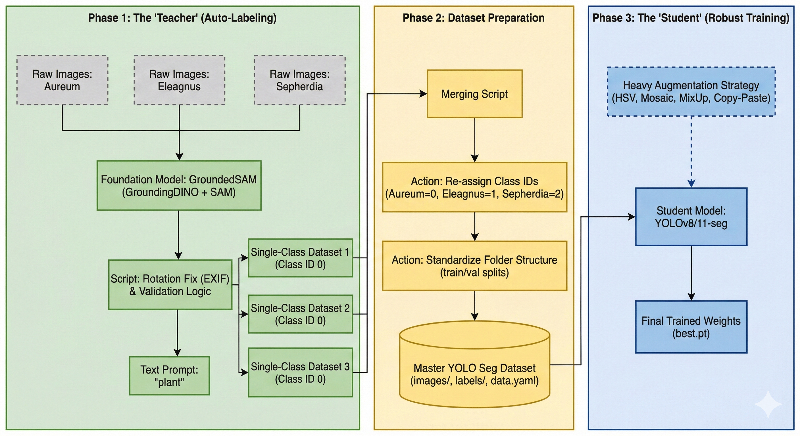
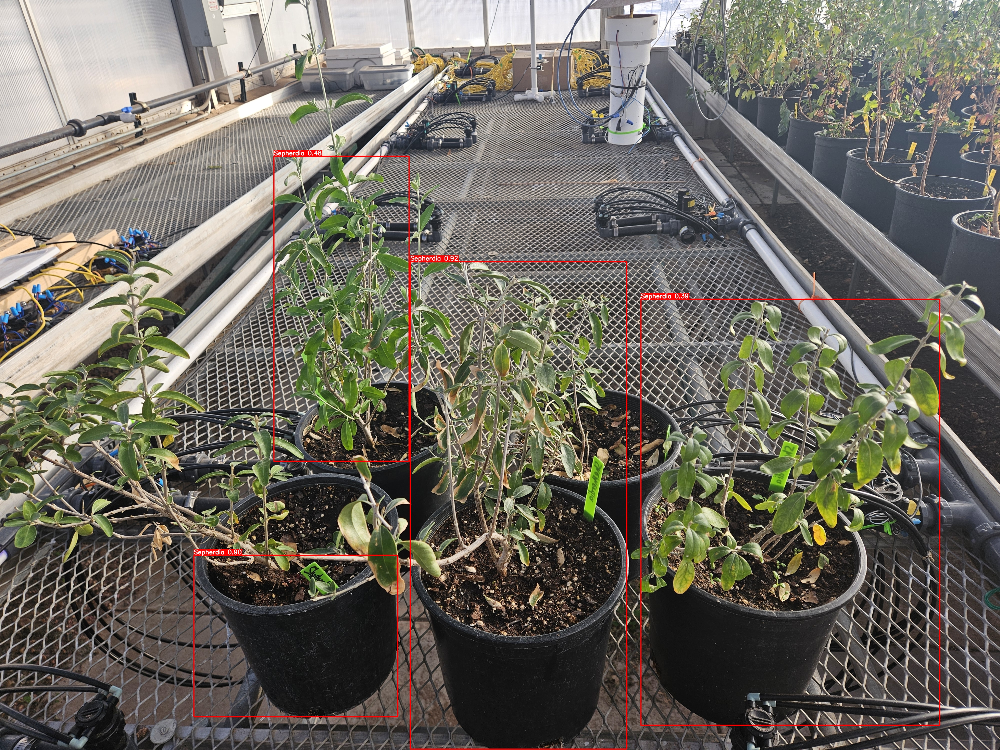
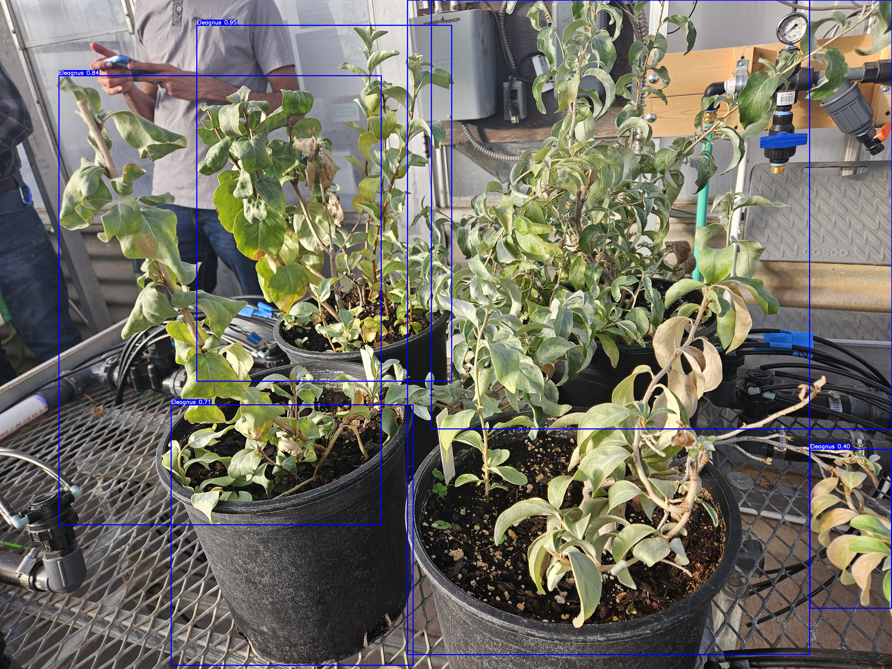
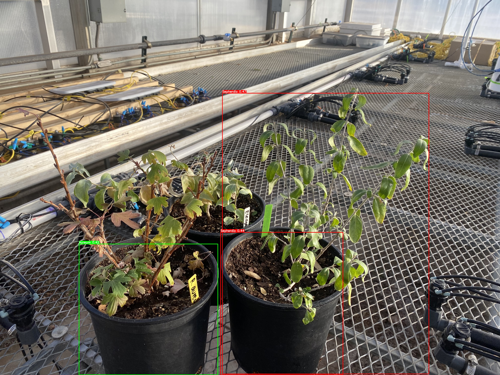

# Wyoming Plants Recognition 




This repository contains two helper scripts to create YOLO-format datasets from raw images using GroundedSAM and to merge per-class YOLO datasets into a single multi-class dataset.

Files of interest

- `data_label.py` — runs GroundedSAM to produce visual previews (annotated images) and a YOLO-style dataset for a single class or for every subfolder under a data root.
- `merge_dataset.py` — merges multiple single-class YOLO datasets into one multi-class YOLO dataset. It can also call `data_label.py` to generate per-class datasets automatically (see `--autolabel`).

Quick prerequisites

- Python 3.8+ (use your project venv)
- pip packages required by `data_label.py` and `merge_dataset.py` (model, `opencv-python`, `supervision`, `pyyaml`, `tqdm`, etc.). If your repo has a `requirements.txt` or `setup.py`, install via:

```sh
# activate your virtualenv first if you use one
. ./venv/bin/activate

# install deps
pip install -r requirements.txt || true

```

Make sure the model code (e.g. `autodistill_grounded_sam`, `autodistill.detection`) is importable in your environment.

Data layout expectations

Option A — Raw class folders (recommended for multi-class pipelines):

```
/home/you/project/data/
  Aureum/
    img001.jpg
    img002.jpg
  Eleagnus/
    img001.jpg
  Sepherdia/
    img001.jpg
```

Option B — Per-class YOLO datasets (created by `data_label.py`):

```
./Aureum_dataset/
  train/
    images/
    labels/
  val/ (or valid/)
    images/
    labels/
  data.yaml
```

How to run

1) Batch label all class folders (raw images -> per-class YOLO datasets + previews)

```sh
python data_label.py \
  --data-root /home/abhattar/auto_label/data \
  --dataset-root . \
  --visual-root .
```

This creates per-class outputs like `./Aureum_dataset` and `./Aureum_labeled_previews`.

2) Verify per-class datasets (quick check)

```sh
ls -R Aureum_dataset | sed -n '1,120p'
# or counts
echo "Aureum images:"; find Aureum_dataset -type f -name '*.jpg' | wc -l
echo "Aureum labels:"; find Aureum_dataset -type f -name '*.txt' | wc -l
```

3) Merge per-class datasets into a combined YOLO dataset

```sh
python merge_dataset.py \
  --data-root /home/abhattar/auto_label/data \
  --dataset-root . \
  --output ./combined_dataset
```

`merge_dataset.py` will look for `./Aureum_dataset`, `./Eleagnus_dataset`, etc. and merge all found datasets into `./combined_dataset`.

4) One-step: auto-generate per-class datasets then merge

If you haven't created per-class datasets yet, `merge_dataset.py` can run `data_label.py` automatically (subprocess) to generate them, then merge.

```sh
python merge_dataset.py \
  --data-root /home/abhattar/auto_label/data \
  --dataset-root . \
  --visual-root . \
  --autolabel \
  --label-script ./data_label.py \
  --output ./combined_dataset
```

Notes: `--label-script` should point to the `data_label.py` script and the same Python environment must have the model packages installed.

Understanding outputs

- `./<Class>_labeled_previews/` — annotated preview images per class.
- `./<Class>_dataset/` — YOLO-style per-class dataset created by the labeler.
- `./combined_dataset/` — final merged dataset with structure:
  - `images/train`, `images/val`
  - `labels/train`, `labels/val`
  - `data.yaml` (with `nc` and `names` in the order used)

Behavior and important details

- Class ID order: when using `--data-root`, classes are discovered using `sorted(os.listdir(...))` (alphabetical). If class order matters, either rename folders or pass explicit `--datasets` to `merge_dataset.py`.
- Filename collisions: images and labels are renamed by prefixing the class name (e.g. `Aureum_img001.jpg`) to avoid collisions.
- Split handling: the scripts accept `valid` or `val` in per-class datasets; both map to `val` in the merged dataset.
- Missing labels: if a label file is missing for an image, the image is still copied; no label file will be present in the merged dataset for that image (i.e., it will be unlabeled).
- Output deletion: `merge_dataset.py` removes the output folder if it already exists — be careful.


## Training and Inference

After you generate your combined dataset (`./combined_dataset`) you can train and run inference with the helper scripts in this repo.

Training

- Script: `train_yolo.py` — trains a YOLOv8 model with robust augmentation settings.
- Default run:
```sh
python train_yolo.py
```
This uses `yolov8s.pt` and the default data path `/home/abhattar/auto_label/combined_dataset/data.yaml`.

Customize the training run with CLI args:
```sh
python train_yolo.py --data ./combined_dataset/data.yaml --model yolov8s.pt --device 0 --epochs 150 --batch 16
```

Inference (video)

- Script: `inference_yolo.py` — runs a trained YOLO model on a video and writes an annotated output.
- Default run:
```sh
python inference_yolo.py
```

Custom example:
```sh
python inference_yolo.py \
  --source /path/to/input.mp4 \
  --target ./annotated_output.mp4 \
  --model runs/detect/train/weights/best.pt \
  --confidence 0.5
```


## Results 





Notes

- Training saves runs under `runs/detect/train/weights/` by default (Ultralytics). The best model is usually at `runs/detect/train/weights/best.pt`.
- Inference uses OpenCV drawing; colors are chosen by class id and will wrap if you have more classes than colors configured.
- For large datasets and training, ensure you have a GPU and enough VRAM. Adjust `--batch` and `--imgsz` accordingly.


***


